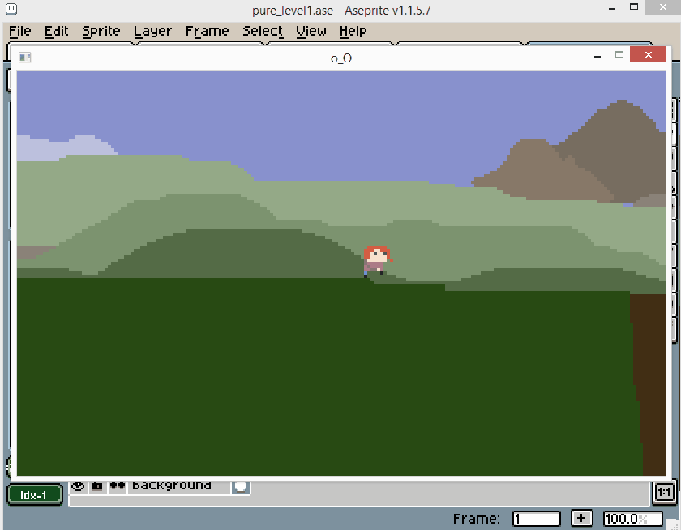
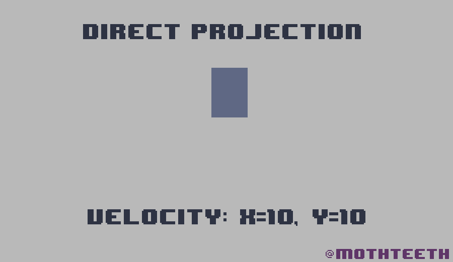
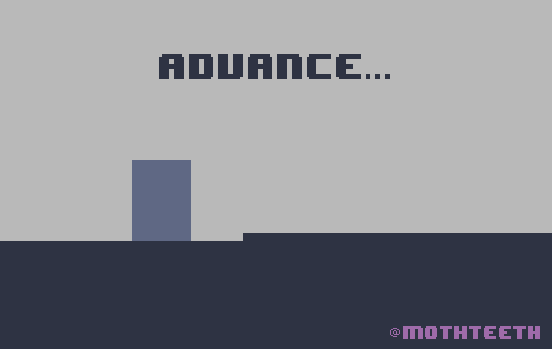

# Pure Pixels

### Pixel Collisions on Image Data 

Quite a few people were interested in the [demo](https://twitter.com/mothteeth/status/1097436572964708352) gif I recently posted of my [Aseprite](https://www.aseprite.org/) based level loader, so I decided to write up a tutorial with some supporting code samples for people to check out.





This tutorial will discuss two main processes:

1 - Making a call out to Aseprite's Command Line Interface, requesting that it export all the layers of my level (an Aseprite file) to your game's Assets directory.

2 - In-game code for colliding with the pixel data contained in the `solid` layer of pixels. 

## Pros and Cons of Pixel Collisions

### Pros 

- No need for a tile editor.
- very direct art pipeline.

### Cons

- Greater memory use.
- Large levels or worlds will require more sophisticated system for dynamically loading and unloading regions.

Being able to have a character collide directly with the pixel data in an image is about as direct as you can get. There's no need to use a tile editor to build your levels, you can just draw them directly in your editor of choice.

As a game developer, it's easy to get trapped in endless tool creation, custom rendering systems, etc. This stuff is great, but in the end we are better off just *making a game*! This is the thinking that drove me to abandon all the custom tile editing tools I was working on, and build something far more simple and direct. I wanted there to be as little between the idea and the expression of that idea as possible. Since I am interested in spending more time making art, why not just make the art all there is? 

I don't see memory concerns as much of a problem on modern hardware. For one thing, pixel art is just naturally small, and levels will never use all that much memory. Also, it's not too complicated to write a system for loading and unloading "chunks" of a 2D world, if you really want to make an enormous interconnected world. 

To put things in perspective, many games made with 2D tile based engines will often still only use "rooms" that are smaller than a single 2048 x 2048 pixel image. That's actually a whole lot of space, and most devices you are likely to target these days will be able to handle many textures of that size, and actually much larger in most cases. You can do a lot with this technique without needing to get too fancy at all.

Mathematically, pixel collisions are really no different from tile based collisions, it's just that the tiles are very teeny tiny. This means we can keep using all the same techniques we used for our tile engines.

Tiles are cool for stylistic and mechanical reasons, but as an optimization they are basically obsolete.

In short, **The Reign of the Tile engines is over! Welcome to the era of Pure Pixels!**

# Exporting From Aseprite

You can start your experiments by just drawing directly into a png image and hitting save, but after a while you are likely to want to export multiple layers, so that you can have backround and foreground objects for the character to move between.

Luckily for Aseprite users, Aseprite has a CLI, (Command Line Interface). This allows us to give it commands from the command line, to automate things like exporting individual layers and frames from our `.ase` file. 

The level data export can be performed directly on the command line, or placed in a script for convenience. 

To make Aseprite available to the command line, either put aseprite on your sytem path, or just put it in a `tools` directory inside your project folder. 

### The Command

I originally put the command into a bash script, with the following contents:

```
../tools/osx/aseprite/aseprite -b --split-layers ../art/levels/level1.ase --save-as ../build/assets/levels/level_1.png
```

This command exports all the layers of the target `.ase` file into the output directory. 
The `-b` of `--batch` tells Aseprite not to open the gui, and `--split-layers`, exports all visible layers to the output directory, using the provided name as a template. The output names are a bit wacky so I also renamed them after the export, but that's optional.

For more information on this and other commmands, see the Aseprite [CLI docs](https://www.aseprite.org/docs/cli/#split-layers).

To make the export more portable, I ended up writing a NodeJS script, which is also included in this repository.

NodeJs is my go-to scripting environment for this kind of task, but you could do it in anything you like, as long as you are able to make a call out to the Aseprite binary.

To run the node script, call it with an extra argument, indicating the target platform.

```node ase_export.js -win```

or 

```node ase_export.js -osx```

The repo includes the `bash` and `js` versions for you to check out.

### Reloading the Level at Runtime

Many engines allow you to call external scripts at runtime, so you can re-export and re-load your level without having to restart your game.

In `C++` you can use the `system()` api.

```
#include <stdlib.h> 
system("node ase_export.js -win");    
```

in `C#` you can use `Process.Start()`

```
using System.Diagnostics;

void AseExport() {
   ProcessStartInfo startInfo = new ProcessStartInfo();
   startInfo.FileName = "node";
   startInfo.Arguments = "ase_export.js -win";
   Process.Start(startInfo);
}
 ```

In `Gamemaker` / `GML`, I'm not too sure about how to do it, but you would probably want to try an extension such as [this one](https://marketplace.yoyogames.com/assets/575/execute-shell).

### Layers

In my system I load several layers: `background`, `background_objects`, `solid`, and `foreground`. I'm won't post the level loading code at this time, as it's probably not hugely useful to most people unless you happen to be writing a game in C++ with SDL2. Instead, I'll explain a bit about it, to help you write your own system in whichever environment you like.

The important part is that you have a way of rendering the various layers, one on top of each other, and that you have the ability to access pixel data of one of those layers, the `solid` layer, so you can test for collisions against it.

To keep things simple, we will only be talking about the `solid` layer from now on.

### How the collisions work

The collision system is actually quite simple, and would probably be quite familiar to users of GameMaker. It works a lot like the classic Gamemaker collision technique found in the [tutorials](https://www.youtube.com/channel/UCn7FE3Tx391g1tWPv-1tv7Q) of Sean Spalding. ([@shaunspalding](https://twitter.com/shaunspalding))

([Here](https://www.youtube.com/watch?v=izNXbMdu348) is a video tutorial showing the basic tile collision technique in Gamemaker.)

An important concept in this technique is that we resolve collisions in the x axis first, and on the y axis second.



The only difference between this system and the classic tile based collision system is that the "tiles" are only the size of a single pixel. That's about it! There's one more trick that I'll get into later, which is that because the "tiles" are so small, we have the opportunity to run up sloped surfaces, which feels really cool as a player!

I generally resolve collisions in a "continuous" fashion, by projecting the object one pixel at a time, in a pixel based integer space. I used to use all kinds of fancy raycasting systems for this, but in the end, the old ways are the best! Easy to write, easy to understand.

The basic process is to simply advance, one pixel at a time, until we have reached the target destination. If we collide with something, we cancel velocity on that axis. Because x and y are resolved separately, this allows us to slide over surfaces in a way that feels good to the player. For example, as we run along the ground we are constantly colliding with the ground as gravity pulls us downward. Our y velocity is constantly reset to zero, but because our x velocity is resolved in a separate phase, we can glide along horizontally as long as we don't run into a wall.

### Climbing Slopes

Adding the ability to climb a diagonal slope is quite simple, but makes interacting with a pixel based environment feel vastly better. 

All you need to do is, when advancing along the x axis, if a collision is detected, test the position one pixel above. If this position is valid, move the object up one pixel and just keep going. 

This step can be repeated multiple times in a single iteration, allowing us to climp anything up to a 45 degree angle.




### Code Samples.

I've included several [code samples](./code_samples) to show how my aseprite exporter works, and also my `C++` [function](./code_samples/pixel_collision.h) for performing pixel collisions, including climbing slopes when making a platform game. The C++ source is heavily commented, and gives some more specific detail.

As a bonus I have included my version of the classic Gamemaker [collision code](./code_samples/bonus_gamemaker_scripts/MoveAndCollideOnGrid.gml), which I used with a Gamemaker based tile engine. This might help if you want to try something like this in Gamemaker. I only dabbled in Gamemaker for a couple of months, so I have become quite unfamiliar with it, however these scripts were working fine last time I checked. ;)

### Thanks

I hope this tutorial is useful to someone. I love to share, and I'm looking forward to hearing about any experiments you might try with this technique.

If you end up converting my C++ code into another language, or have any related code you'd like to share, it would be really cool if you wanted to contribute it to this repository for others to look at. Just ping me on twitter [@mothteeth](https://twitter.com/mothteeth), or here on github.
